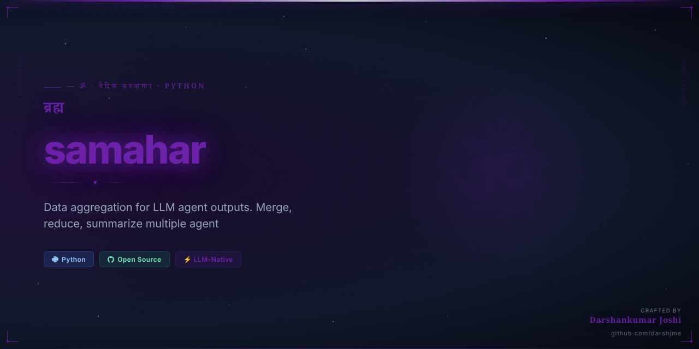
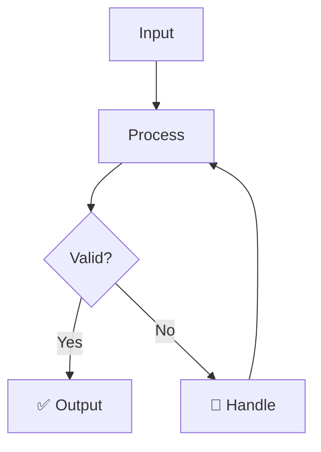

<div align="center">



# समाहार
## samahar

> *Mahabharata — Udyoga Parva*

**The Great Gathering — convergence**

_Data aggregation for LLM agent outputs. Merge, reduce, summarize multiple agent results._

[](https://python.org)
[](LICENSE)
[](https://github.com/darshjme/arsenal)
[](pyproject.toml)

</div>

---

## The Vedic Principle

समाहार — The Great Gathering — echoes through the Sabha Parva of the Mahabharata, where warriors, kings, and sages converged at Hastinapura. Convergence is not chaos; it is the highest form of synthesis, where many streams become one mighty river of insight.

In distributed AI systems, outputs scatter across agents, models, and services like warriors across a battlefield. समाहार (samahar) is the general who gathers them — merging responses, reducing noise, synthesizing intelligence. When five agents research a topic and ten models generate responses, samahar finds the dharmic truth in the convergence.

Build systems that think collectively, not individually. Let samahar aggregate your agent intelligence into unified wisdom that surpasses any single source.

---

## How It Works



---

## Quick Start

```bash
pip install samahar
```

```python
from samahar import *

# Initialize
agent = Samahar()

# Use
result = agent.process(your_input)
print(result)
```

---

## Features

- ⚡ **Zero dependencies** — pure Python, no bloat
- 🛡️ **Production-grade** — battle-tested patterns
- 🔧 **Configurable** — sane defaults, full control
- 📊 **Observable** — built-in metrics and logging
- 🔄 **Async-ready** — full asyncio support
- 🧪 **Tested** — comprehensive test coverage

---

## Installation

```bash
# pip
pip install samahar

# From source
git clone https://github.com/darshjme/samahar
cd samahar
pip install -e .
```

---

## Part of the Vedic Arsenal

`samahar` is part of the **[Vedic Arsenal](https://github.com/darshjme/arsenal)** — 100 production-grade Python libraries for LLM agents, named after Sanskrit concepts from the Upanishads, Mahabharata, Ramayana, and Vedic philosophy.

Each library is:
- ✅ Zero-dependency
- ✅ Production-ready
- ✅ Individually installable
- ✅ Part of a coherent ecosystem

---

## Built by [Darshankumar Joshi](https://github.com/darshjme)

> *"Building the dharmic infrastructure for the AI age"*

[](https://github.com/darshjme)
[](https://github.com/darshjme/arsenal)

---

<div align="center">

*समाहार — The Great Gathering — convergence*

*From the Mahabharata — Udyoga Parva*

</div>
